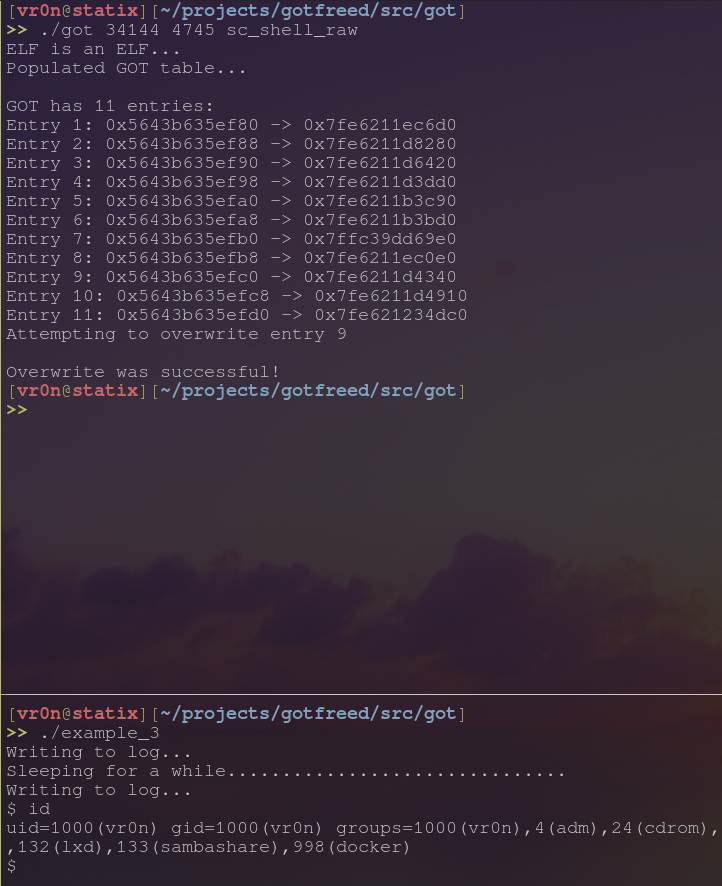

# Intro

Attempting to do some low level ELF stuff. The code is now working as expected but needs some heavy cleanup.

# Why?

Because I'm awesome.

# What?

I am taking inspiration from the [`triplecross`](https://github.com/h3xduck/TripleCross), but I am only paying attention to the GOT table portion.

# Example

