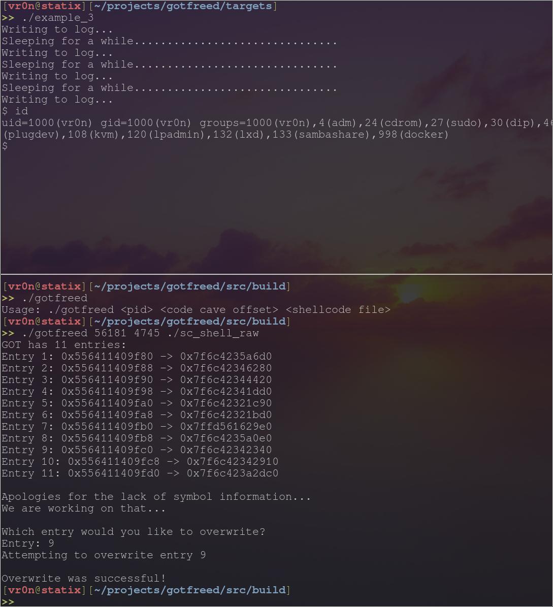

# Intro

Attempting to do some low level ELF stuff. The code is now working as expected but needs some heavy cleanup.

# Why?

Because I'm awesome.

# What?

I am taking inspiration from the [`triplecross`](https://github.com/h3xduck/TripleCross), but I am only paying attention to the GOT table portion.

# Example

The below example is a very basic proof of concept for what I was trying to achieve.

A long running process (`example_3` in this case) that you have previous knowledge of is accessed and its GOT is extracted. We jump to a specified offset, write our own code, jump to a desired GOT entry, overwrite the address it points to, and then (when the function in the GOT is called again) our code is executed.

The aforementioned "previous knowledge" you must have is the following:

1. The process ID of the process
2. You have to know the offset from the base address of the code cave you want to overwrite
3. What GOT entries are expected to be in the process and which one you want to overwrite (ideally, one that is called as frequently as you want)

In the below example, The first argument to `got` is the PID, followed by the code cave offset, followed by the shell code file that is going to be written to the code cave. In this case, the shell code calls `/bin/sh`. Realistically, you probably don't want to call `/bin/sh` in the shell code directly like this, but this is the easiest way to demonstrate what is happening.

`example_3` is a simple logging process which is runs in the foreground until you kill it. The GOT entry I wanted to overwrite is `fflush` which was entry 9 on my system (I am not 100% how the GOT orders its entries, but in my case the entry was *always* number 9 and I expect it will always be 9 if the same GLIBC is being used on your system).

The lower half of the photo shows `example_3`'s output at the time the next `fflush` is called *after* `got` has been run.

